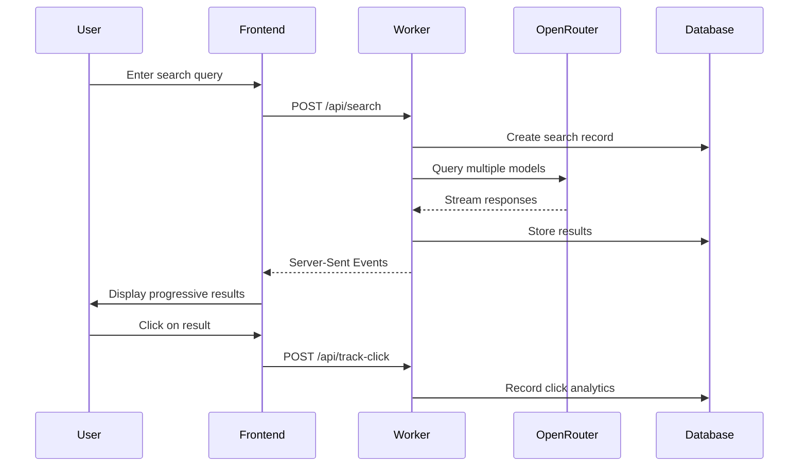
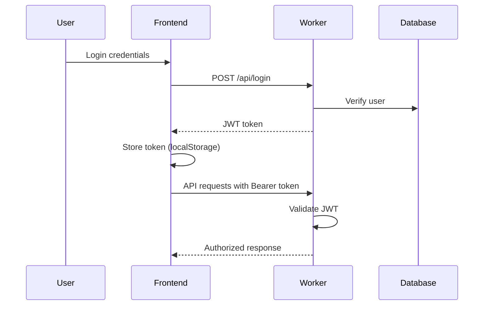

# VistAI Architecture Documentation

This document provides a comprehensive overview of VistAI's system architecture, design decisions, and component interactions.

## Table of Contents
- [System Overview](#system-overview)
- [Architecture Patterns](#architecture-patterns)
- [Component Breakdown](#component-breakdown)
- [Data Flow](#data-flow)
- [Technology Stack](#technology-stack)
- [Design Decisions](#design-decisions)
- [Scalability Considerations](#scalability-considerations)
- [Integration Points](#integration-points)

## System Overview

VistAI is a multi-model AI search platform that aggregates responses from various language models via OpenRouter, providing users with comparative results and analytics. The system follows a modern serverless architecture with clear separation between frontend, backend, and data layers.

### High-Level Architecture

```
┌─────────────────┐    ┌─────────────────┐    ┌─────────────────┐
│                 │    │                 │    │                 │
│   Frontend      │    │   Backend       │    │   External      │
│   (React SPA)   │◄──►│ (CF Worker)     │◄──►│   Services      │
│                 │    │                 │    │                 │
└─────────────────┘    └─────────────────┘    └─────────────────┘
│                      │                      │
│ • React 18          │ • Cloudflare        │ • OpenRouter API
│ • TypeScript        │   Workers           │ • Multiple LLMs
│ • Tailwind CSS     │ • Hono Framework    │   - GPT-4
│ • Tanstack Query   │ • JWT Auth          │   - Claude
│ • Wouter Router    │ • D1 Database       │   - Gemini
│ • Radix UI         │ • Server-Sent       │   - Llama
│                     │   Events            │   - Mistral
└─────────────────────┴─────────────────────┴─────────────────────┘
```

### Core Principles

1. **Serverless-First**: Leverages Cloudflare's edge infrastructure for global performance
2. **Real-Time Streaming**: Server-Sent Events for live search result updates
3. **Modular Design**: Clear separation of concerns across components
4. **Progressive Enhancement**: Works without JavaScript, enhanced with React
5. **Performance-Focused**: Optimized for speed and minimal resource usage

## Architecture Patterns

### 1. **Presentation Layer Pattern**
- **Pattern**: Component-Based Architecture with Hooks
- **Implementation**: React functional components with custom hooks
- **Benefits**: Reusable UI components, clear state management, testable logic

### 2. **API Gateway Pattern**
- **Pattern**: Single entry point for all client requests
- **Implementation**: Cloudflare Worker with route handling
- **Benefits**: Centralized authentication, rate limiting, request validation

### 3. **Event Streaming Pattern**
- **Pattern**: Server-Sent Events for real-time updates
- **Implementation**: Streaming search results as they arrive
- **Benefits**: Improved perceived performance, progressive result display

### 4. **Repository Pattern**
- **Pattern**: Data access abstraction layer
- **Implementation**: Database functions in `worker/db.js`
- **Benefits**: Testable data layer, easier database migrations

## Component Breakdown

### Frontend Architecture (`client/`)

```
client/src/
├── components/          # Reusable UI components
│   ├── ui/             # Base UI components (Radix + Tailwind)
│   ├── SearchBar.tsx   # Main search interface
│   ├── ResultCard.tsx  # Individual result display
│   └── Header.tsx      # Application header
├── pages/              # Route-level components
│   ├── Home.tsx        # Landing page
│   ├── SearchResults.tsx # Search results display
│   ├── Dashboard.tsx   # Analytics dashboard
│   └── Settings.tsx    # User settings
├── lib/                # Utility libraries
│   ├── utils.ts        # Helper functions
│   ├── openrouter.ts   # OpenRouter API client
│   └── queryClient.ts  # HTTP client with auth
├── hooks/              # Custom React hooks
│   └── use-mobile.tsx  # Mobile detection
└── contexts/           # React context providers
    └── AuthContext.tsx # Authentication state
```

#### Component Hierarchy

```
App
├── Header
│   ├── SearchBar (compact mode)
│   └── UserMenu
├── Router
│   ├── Home
│   │   └── SearchBar (full mode)
│   ├── SearchResults
│   │   ├── ModelFilterPills
│   │   ├── ResultCard[]
│   │   └── LoadingSkeleton
│   ├── Dashboard
│   │   ├── ModelStatsChart
│   │   └── PopularQueries
│   └── Settings
│       ├── ThemeToggle
│       └── ApiKeyInput
└── Footer
```

### Backend Architecture (`worker/`)

```
worker/
├── worker.js           # Main worker entry point
├── db.js              # Database access layer
└── migrations/        # Database schema definitions
    └── 0001_init.sql
```

#### Worker Request Flow

```
Request → CORS Headers → Authentication → Route Handler → Response

Route Handlers:
├── /api/status        # Health check
├── /api/auth/*        # Authentication endpoints
├── /api/search        # Multi-model search
├── /api/analytics/*   # Usage analytics
└── /docs             # API documentation
```

### Database Schema (`shared/`)

```
shared/
└── schema.ts          # Shared type definitions and Drizzle schema
```

#### Entity Relationship Diagram

```
┌─────────────┐    ┌─────────────┐    ┌─────────────┐
│    users    │    │  searches   │    │   results   │
├─────────────┤    ├─────────────┤    ├─────────────┤
│ id (PK)     │    │ id (PK)     │    │ id (PK)     │
│ username    │    │ query       │    │ search_id   │◄─┐
│ password    │    │ created_at  │    │ model_id    │  │
└─────────────┘    └─────────────┘    │ content     │  │
       │                    │         │ title       │  │
       │                    │         │ response_time│ │
       │           ┌────────┴─────────│ created_at  │  │
       │           │                  └─────────────┘  │
       │           │                           │       │
       │      ┌────▼────┐                 ┌───▼───────▼──┐
       │      │ clicks  │                 │ model_stats  │
       │      ├─────────┤                 ├──────────────┤
       │      │ id (PK) │                 │ id (PK)      │
       └─────►│ user_id │                 │ model_id     │
              │result_id│                 │ click_count  │
              │created_at│                │ search_count │
              └─────────┘                 │ updated_at   │
                                         └──────────────┘
```

## Data Flow

### 1. **Search Request Flow**



### 2. **Authentication Flow**



### 3. **Real-Time Search Streaming**

```
1. User submits query
2. Worker creates search record
3. Worker initiates parallel model requests
4. For each model response:
   a. Stream 'result' event to client
   b. Store result in database
   c. Update model statistics
5. Send 'done' event with final summary
6. Client progressively displays results
```

## Technology Stack

### Frontend Technologies

| Technology | Purpose | Justification |
|------------|---------|---------------|
| **React 18** | UI Framework | Modern hooks, concurrent features, large ecosystem |
| **TypeScript** | Type Safety | Compile-time error detection, better IDE support |
| **Tailwind CSS** | Styling | Utility-first, consistent design system, small bundle |
| **Radix UI** | Component Library | Accessible, unstyled primitives, customizable |
| **Tanstack Query** | Server State | Caching, background updates, optimistic updates |
| **Wouter** | Routing | Lightweight (1.3KB), simple API, no dependencies |
| **Vite** | Build Tool | Fast HMR, modern ES modules, optimized builds |

### Backend Technologies

| Technology | Purpose | Justification |
|------------|---------|---------------|
| **Cloudflare Workers** | Runtime | Edge computing, zero cold starts, automatic scaling |
| **D1 Database** | Storage | SQLite-compatible, serverless, integrated with CF |
| **Drizzle ORM** | Database Layer | Type-safe, lightweight, good CF Workers support |
| **JWT** | Authentication | Stateless, scalable, standard format |
| **Server-Sent Events** | Real-time Updates | Simple, browser-native, better than WebSockets for this use case |

### External Services

| Service | Purpose | Integration |
|---------|---------|-------------|
| **OpenRouter** | AI Model Access | REST API, multiple LLM providers |
| **Cloudflare Pages** | Frontend Hosting | Static site deployment, global CDN |
| **Cloudflare Analytics** | Monitoring | Built-in metrics, performance tracking |

## Design Decisions

### 1. **Why Cloudflare Workers over Traditional Servers?**

**Decision**: Use Cloudflare Workers for the backend API

**Rationale**:
- **Global Performance**: Edge computing reduces latency worldwide
- **Zero Cold Starts**: Unlike AWS Lambda, Workers start instantly
- **Cost Effective**: Pay-per-request model, no idle server costs
- **Integrated Ecosystem**: D1 database, Pages hosting, Analytics

**Trade-offs**:
- Limited to JavaScript/TypeScript
- Some Node.js APIs not available
- Vendor lock-in to Cloudflare

### 2. **Why Server-Sent Events over WebSockets?**

**Decision**: Use Server-Sent Events for real-time search results

**Rationale**:
- **Simplicity**: Built-in browser support, no additional libraries
- **Reliability**: Automatic reconnection, better error handling
- **Unidirectional**: Perfect fit for streaming search results
- **HTTP-Compatible**: Works with existing infrastructure

**Trade-offs**:
- One-way communication only
- Less efficient for bidirectional data

### 3. **Why Wouter over React Router?**

**Decision**: Use Wouter for client-side routing

**Rationale**:
- **Bundle Size**: 1.3KB vs 13KB+ for React Router
- **Simplicity**: Hook-based API, minimal learning curve
- **Performance**: No unnecessary re-renders

**Trade-offs**:
- Smaller ecosystem
- Fewer advanced features

### 4. **Why localStorage for JWT Storage?**

**Decision**: Store JWT tokens in localStorage (with security caveats)

**Rationale**:
- **Simplicity**: Easy implementation, no server-side session management
- **Persistence**: Tokens survive browser refreshes
- **Compatibility**: Works across all browsers and deployment scenarios

**Trade-offs**:
- **Security Risk**: Vulnerable to XSS attacks
- **Note**: This should be migrated to HttpOnly cookies in production

### 5. **Why SQLite (D1) over PostgreSQL/MongoDB?**

**Decision**: Use Cloudflare D1 (SQLite) for data storage

**Rationale**:
- **Integration**: Native Cloudflare Workers support
- **Performance**: Local database, no network latency
- **Simplicity**: SQL-based, familiar query language
- **Cost**: Included with Cloudflare Workers

**Trade-offs**:
- Write scalability limitations
- Fewer advanced features than PostgreSQL

## Scalability Considerations

### Current Architecture Limitations

1. **Database Writes**: D1/SQLite limited to single-writer
2. **Memory Usage**: Worker memory limits (128MB)
3. **Execution Time**: 30-second timeout for Worker requests
4. **Storage**: D1 database size limits

### Scaling Strategies

#### Horizontal Scaling
```
┌─────────────┐    ┌─────────────┐    ┌─────────────┐
│   Region    │    │   Region    │    │   Region    │
│   US-East   │    │   EU-West   │    │  Asia-Pac   │
├─────────────┤    ├─────────────┤    ├─────────────┤
│ CF Worker   │    │ CF Worker   │    │ CF Worker   │
│ D1 Replica  │    │ D1 Replica  │    │ D1 Replica  │
└─────────────┘    └─────────────┘    └─────────────┘
```

#### Caching Strategy
```
Request → Edge Cache → Origin Worker → D1 Database
         (Static)    (Dynamic)      (Persistent)
```

#### Performance Optimizations
1. **Read Replicas**: Use D1 read replicas for analytics queries
2. **Edge Caching**: Cache search results for popular queries
3. **Request Batching**: Batch analytics updates
4. **Background Processing**: Use Durable Objects for heavy computations

### Monitoring and Observability

```
Application Metrics:
├── Search Response Times
├── Model Performance Stats
├── User Engagement Metrics
└── Error Rates

Infrastructure Metrics:
├── Worker Execution Duration
├── Database Query Performance
├── Memory Usage
└── Request Rates

Business Metrics:
├── Daily Active Users
├── Search Volume
├── Model Preference Trends
└── User Retention
```

## Integration Points

### External API Integration

#### OpenRouter API
```typescript
interface OpenRouterIntegration {
  endpoint: 'https://openrouter.ai/api/v1/chat/completions';
  authentication: 'Bearer Token';
  rateLimit: 'Per API key limits';
  models: 'Dynamic model selection';
  fallback: 'Predefined model list';
}
```

#### Integration Patterns
1. **Circuit Breaker**: Fallback when OpenRouter is unavailable
2. **Retry Logic**: Exponential backoff for failed requests
3. **Load Balancing**: Distribute requests across models
4. **Caching**: Cache model lists and popular responses

### Frontend-Backend Integration

#### API Client Architecture
```typescript
// Centralized API client with auth and error handling
const apiClient = {
  auth: AuthContext,
  http: QueryClient,
  streaming: EventSource,
  errorHandling: ErrorBoundary
};
```

#### State Synchronization
```
Local State (React) ←→ Server State (Tanstack Query) ←→ Database (D1)
```

## Future Architecture Considerations

### Planned Enhancements

1. **Microservices Split**: Separate auth, search, and analytics services
2. **Event-Driven Architecture**: Use Cloudflare Queues for async processing
3. **AI Model Caching**: Cache and serve popular model responses
4. **Multi-Tenancy**: Support for organization accounts
5. **Advanced Analytics**: Real-time dashboards with Clickhouse

### Migration Paths

#### Database Migration Strategy
```
Phase 1: Current D1 SQLite
Phase 2: D1 with read replicas
Phase 3: Hybrid D1 + specialized databases
Phase 4: Full microservices with event sourcing
```

#### Frontend Evolution
```
Phase 1: Current React SPA
Phase 2: Add service worker for offline support
Phase 3: Progressive Web App (PWA)
Phase 4: Server-side rendering with Next.js
```

---

**Last Updated**: January 2025  
**Architecture Version**: 1.0  
**Next Review**: April 2025